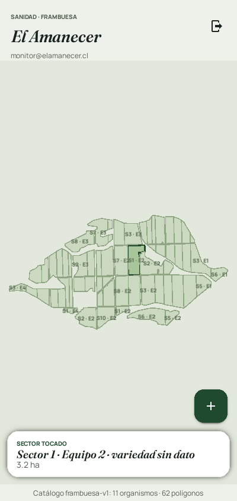

# Sanidad · El Amanecer

App Android para monitorear enfermedades, plagas y malezas en frambuesa.
Está escrita en Python con Kivy + KivyMD y se compila con Buildozer.
Es la app "hermana" de la app de fenología.

La especificación completa está en [`SPEC.md`](SPEC.md). Este repositorio
va en la **etapa 1 (Base del proyecto)**.

| Inicio de sesión | Mapa provisorio* |
|---|---|
|  |  |

\* La captura del mapa usa polígonos **sintéticos** sacados del boceto, no
las coordenadas reales del predio.

## Estructura

```
main.py                     Punto de entrada (Buildozer busca main.py)
buildozer.spec              Configuración del APK
firebase_config.example.json  Plantilla de configuración (copiar a firebase_config.json)
datos/
  catalogo-frambuesa-v1.json  Organismos, protocolos y umbrales
  sectores-el-amanecer.json   Polígonos del predio (falta agregarlo)
assets/                     Fuentes (Manrope, Fraunces), ícono y pantalla de carga
sanidad/
  db/          Base SQLite local (esquema, altas, ediciones, anulaciones)
  firebase/    Cliente REST: Authentication y Firestore
  catalogo/    Carga y validación del catálogo
  geo/         Sectores GeoJSON, punto-en-polígono y proyección a pantalla
  sesion.py    Sesión del monitor (inicio, renovación del token, cierre)
  ui/          Interfaz Kivy/KivyMD: tema, pantallas y archivos .kv
tests/         Pruebas con pytest de todo lo que no es interfaz
```

## Configurar Firebase

1. En la [consola de Firebase](https://console.firebase.google.com), abre el
   proyecto (o créalo) y ve a **Configuración del proyecto → General**.
2. Si no hay una app web registrada, agrega una con el ícono `</>`. No hace
   falta Hosting. Solo se usa para obtener la **clave de API web**.
3. Copia la plantilla y completa los dos datos:

   ```bash
   cp firebase_config.example.json firebase_config.json
   ```

   - `apiKey`: la "Clave de API web".
   - `projectId`: el "ID del proyecto".

   `firebase_config.json` está en `.gitignore`: **no se sube al repositorio**.
   Buildozer sí lo empaqueta dentro del APK cuando el archivo existe en la
   carpeta al compilar. La clave de API web de Firebase no es secreta, porque
   lo que protege los datos son las reglas de seguridad (etapa 4). Aun así,
   se mantiene fuera de GitHub.
4. **Authentication → Método de acceso**: activa **Correo electrónico/contraseña**.
5. **Authentication → Usuarios → Agregar usuario**: crea la cuenta de cada
   monitor con su correo y una contraseña inicial.
6. **Firestore Database → Crear base de datos**, en la región elegida
   (`southamerica-west1` para Santiago).

Para que GitHub Actions compile el APK con la configuración incluida, crea
en el repositorio el secreto **`FIREBASE_CONFIG`** con el contenido completo
de tu `firebase_config.json`: *Settings → Secrets and variables → Actions →
New repository secret*.

## Probar en el computador

Con Python 3.10 o superior:

```bash
python3 -m venv .venv
source .venv/bin/activate
pip install -r requirements-dev.txt
python -m pytest -q tests     # pruebas automáticas
python main.py                # abre la app en una ventana del tamaño de un teléfono
```

## Compilar el APK

### Opción A: GitHub Actions (automática)

Cada push corre las pruebas y, si pasan, compila un APK de prueba
(*debug*). Para descargarlo: pestaña **Actions** del repositorio → la
ejecución más reciente de "Pruebas y APK" → sección **Artifacts** →
`sanidad-apk-debug` (un .zip con el .apk adentro).

La primera compilación demora entre 20 y 40 minutos porque descarga el SDK
y el NDK de Android. Las siguientes usan caché y son más rápidas.

### Opción B: en tu Windows con WSL (igual que la app de fenología)

Dentro de Ubuntu en WSL (el proyecto debe estar en el disco de Linux, por
ejemplo `~/AppSanidadVegetal`, **no** en `/mnt/c/...`):

```bash
sudo apt update
sudo apt install -y git zip unzip openjdk-17-jdk python3-pip autoconf automake libtool \
  pkg-config zlib1g-dev libncurses5-dev libncursesw5-dev cmake libffi-dev libssl-dev
pip3 install --user "buildozer==1.5.0" "cython==0.29.36"

git clone https://github.com/DJuaqo-Rothmund/AppSanidadVegetal.git
cd AppSanidadVegetal
cp firebase_config.example.json firebase_config.json   # y complétalo
buildozer android debug
```

El APK queda en `bin/`. Para copiarlo a Windows:
`cp bin/*.apk /mnt/c/Users/<tu-usuario>/Downloads/`.

### Versión

La versión está en `sanidad/__init__.py` (`__version__`). Súbela antes de
cada entrega, porque Android solo instala encima si la versión es mayor.

## Enviar el APK por Firebase App Distribution

1. En la consola de Firebase, **Configuración del proyecto → Tus apps →
   Agregar app → Android**, con el nombre de paquete
   **`cl.elamanecer.sanidad`**. No hace falta descargar
   `google-services.json`. Anota el **ID de la app** (`1:…:android:…`).
2. **App Distribution → Testers y grupos**: crea el grupo
   `monitores-el-amanecer` y agrega los correos de los monitores.
3. Sube el APK. Hay dos formas:
   - **Consola**: App Distribution → arrastra el `.apk` → elige el grupo →
     escribe las notas de la versión en español → *Distribuir*.
   - **Terminal** (con [Firebase CLI](https://firebase.google.com/docs/cli)):

     ```bash
     firebase login
     firebase appdistribution:distribute bin/sanidad-0.1.0-arm64-v8a_armeabi-v7a-debug.apk \
       --app 1:XXXXXXXX:android:XXXXXXXX \
       --groups monitores-el-amanecer \
       --release-notes "Etapa 1: inicio de sesión y mapa provisorio"
     ```
4. Cada monitor recibe un correo. Desde el teléfono:
   - abre el enlace y acepta la invitación;
   - instala la app **App Tester** cuando lo pida (o descarga directo);
   - la primera vez Android pide permitir **"instalar apps de origen
     desconocido"** para el navegador o App Tester;
   - abre **Sanidad · El Amanecer** y entra con su correo y contraseña.

> **Firma.** El APK *debug* se firma con una llave de prueba que Buildozer
> crea en cada equipo. Sirve para la etapa 1. Antes de que los monitores
> usen la app en serio hay que crear la **llave de firma de producción**
> (keystore) y compilar en modo *release*. Esa llave se guarda fuera del
> repositorio y con respaldo, porque sin ella no se puede actualizar la app
> instalada.

## Pruebas

```bash
python -m pytest -q tests
```

Cubren la base SQLite (esquema, UUID, auditoría, anulación, marca
pendiente), el cliente de Firebase con respuestas simuladas (inicio de
sesión, errores en español, renovación del token, conversión de valores,
paginación, consultas por `actualizadoEn`), la sesión, el catálogo y la
geometría. Las pruebas no usan red ni Kivy.
