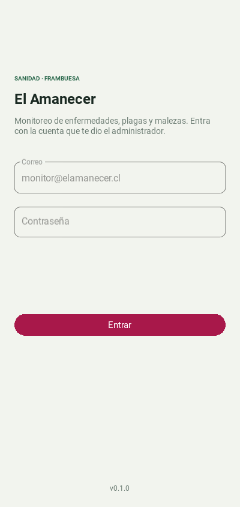
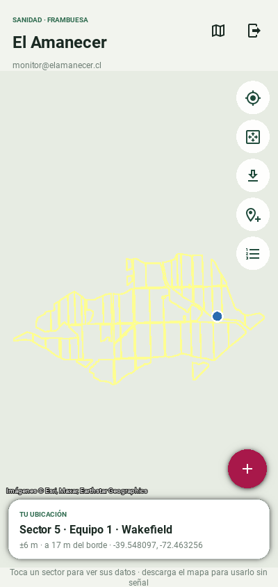
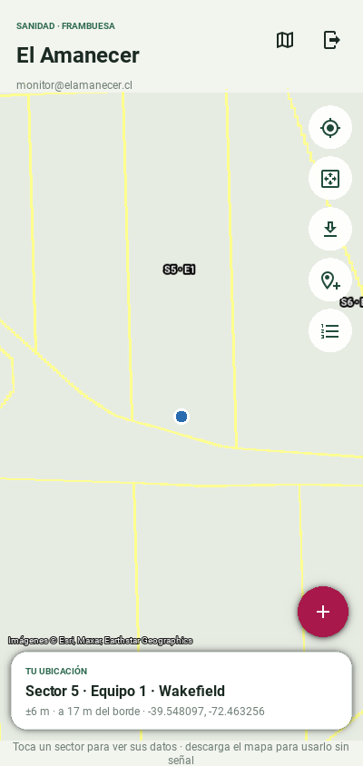

# Sanidad · El Amanecer

App Android para monitorear enfermedades, plagas y malezas en frambuesa.
Está escrita en Python con Kivy + KivyMD y se compila con Buildozer.
Es la app "hermana" de la app de fenología (PhenoRubus): usa su misma
paleta, tipografía y forma de compilar.

La especificación completa está en [`SPEC.md`](SPEC.md). Este repositorio
va en la **etapa 2 (Mapa y sectores)**.

| Inicio de sesión | Predio | Tu ubicación |
|---|---|---|
|  |  |  |

Las capturas se tomaron sin acceso a ESRI, así que el fondo aparece liso. En
el teléfono se ve la imagen satelital.

## Estructura

```
main.py                     Punto de entrada (Buildozer busca main.py)
buildozer.spec              Configuración del APK
firebase_config.example.json  Plantilla de configuración (copiar a firebase_config.json)
datos/
  catalogo-frambuesa-v1.json  Organismos, protocolos y umbrales
  sectores-el-amanecer.json   62 polígonos del predio (40 sectores, 196,3 ha)
scripts/importar_sectores.py  Regenera los polígonos desde el GeoJSON de sectorización
assets/                     Ícono y pantalla de carga
sanidad/
  db/          Base SQLite local (esquema, altas, ediciones, anulaciones)
  firebase/    Cliente REST: Authentication y Firestore
  catalogo/    Carga y validación del catálogo
  geo/         Sectores GeoJSON, punto-en-polígono, distancia al borde y teselas (MBTiles)
  gps.py       GPS del teléfono (plyer) o simulado en el computador
  sesion.py    Sesión del monitor (inicio, renovación del token, cierre)
  prueba_terreno.py  Puntos de prueba de la etapa 2 (sector deducido vs. plano)
  ui/          Interfaz Kivy/KivyMD: tema, pantallas y archivos .kv
tests/         Pruebas con pytest de todo lo que no es interfaz
```

## Sectores del predio

`datos/sectores-el-amanecer.json` se genera desde `el_amanecer.geojson` del
repositorio PuntoRiesgo (sectorización del plano DWG, 40 sectores). Cada
parte no contigua de un sector queda como un polígono propio: son 62 en
total. Cada polígono lleva el `sector_id` de su sector, su superficie
calculada y la del sector completo:

Variedades: todos los sectores son **Wakefield**, salvo el Sector 1 · Equipo 1,
que tiene **Meeker y Cascade Harvest**. Falta saber cuál de las dos va en cada
una de sus 4 partes; mientras tanto, esas partes quedan con la variedad en
blanco y la lista del sector en `variedades_sector`.

```bash
python scripts/importar_sectores.py ../PuntoRiesgo/src/assets/data/el_amanecer.geojson \
  datos/sectores-el-amanecer.json --variedad-por-defecto Wakefield
```

## Mapa, GPS y uso sin señal (etapa 2)

- **Mapa satelital:** usa ESRI World Imagery. Cada tesela que se ve con
  señal queda guardada en `mapa/esri_world_imagery.mbtiles`, dentro de los
  datos de la app. Sin señal, el mapa usa lo guardado. Si te acercas más allá
  de lo descargado, agranda la imagen del zoom anterior.
- **Descargar el mapa del predio:** botón ⬇ del mapa. Baja las teselas del
  zoom 13 al 19 que tocan cada sector, más 250 m de margen: unas 2100 teselas,
  ~50 MB. Conviene hacerlo con wifi. Se puede detener y retomar, y se corta
  sola si se pierde la señal.
- **Vista esquemática:** el botón del mapa en el encabezado cambia entre
  satélite y esquema, que dibuja solo los polígonos.
- **GPS:** la tarjeta inferior muestra:
  - el sector, equipo y variedad deducidos;
  - la precisión del GPS y la distancia al borde;
  - las coordenadas.

  Si la precisión es mayor que la distancia al borde, avisa **"Cerca del
  borde: confirma el sector"**. Fuera del predio, indica el sector más
  cercano.
- **Prueba de 10 puntos:** el botón 📍+ anota el punto actual con una nota,
  por ejemplo lo que dice el plano, y el botón de lista muestra los puntos
  anotados para compararlos con el plano.
- **En el computador:** no hay GPS, así que se simula con una variable de
  entorno:

  ```bash
  SANIDAD_GPS_FALSO="-39.548097,-72.463256,6" python main.py   # lat, lng, precisión en m
  ```

> **Términos de ESRI.** La descarga masiva y el uso sin señal de World
> Imagery están sujetos a los términos de Esri. Revisa que tu uso lo permita.

## Configurar Firebase

1. En la [consola de Firebase](https://console.firebase.google.com), abre el
   proyecto (o créalo) y ve a **Configuración del proyecto → General**.
2. Si no hay una app web registrada, agrega una con el ícono `</>`. No hace
   falta Hosting. Solo se usa para obtener la **clave de API web**.
3. Copia la plantilla y completa los dos datos:

   ```bash
   cp firebase_config.example.json firebase_config.json
   ```

   - `apiKey`: la "Clave de API web".
   - `projectId`: el "ID del proyecto".

   `firebase_config.json` está en `.gitignore`: **no se sube al repositorio**.
   Buildozer sí lo empaqueta dentro del APK cuando el archivo existe en la
   carpeta al compilar. La clave de API web de Firebase no es secreta, porque
   lo que protege los datos son las reglas de seguridad (etapa 4). Aun así,
   se mantiene fuera de GitHub.
4. **Authentication → Método de acceso**: activa **Correo electrónico/contraseña**.
5. **Authentication → Usuarios → Agregar usuario**: crea la cuenta de cada
   monitor con su correo y una contraseña inicial.
6. **Firestore Database → Crear base de datos**, en la región elegida
   (`southamerica-west1` para Santiago).

Para que GitHub Actions compile el APK con la configuración incluida, crea
en el repositorio el secreto **`FIREBASE_CONFIG`** con el contenido completo
de tu `firebase_config.json`: *Settings → Secrets and variables → Actions →
New repository secret*.

## Probar en el computador

Con Python 3.10 o superior:

```bash
python3 -m venv .venv
source .venv/bin/activate
pip install -r requirements-dev.txt
python -m pytest -q tests     # pruebas automáticas
python main.py                # abre la app en una ventana del tamaño de un teléfono
```

## Compilar el APK

### Opción A: GitHub Actions (automática)

Cada push corre las pruebas y, si pasan, compila un APK de prueba
(*debug*). Para descargarlo: pestaña **Actions** del repositorio → la
ejecución más reciente de "Pruebas y APK" → sección **Artifacts** →
`sanidad-apk-debug` (un .zip con el .apk adentro).

La primera compilación demora entre 20 y 40 minutos porque descarga el SDK
y el NDK de Android. Las siguientes usan caché y son más rápidas.

### Opción B: en tu Windows con WSL (igual que la app de fenología)

Dentro de Ubuntu en WSL (el proyecto debe estar en el disco de Linux, por
ejemplo `~/AppSanidadVegetal`, **no** en `/mnt/c/...`):

```bash
sudo apt update
sudo apt install -y git zip unzip openjdk-17-jdk python3-pip autoconf automake libtool \
  pkg-config zlib1g-dev libncurses5-dev libncursesw5-dev cmake libffi-dev libssl-dev
pip3 install --user "buildozer==1.5.0" "cython==0.29.36"

git clone https://github.com/DJuaqo-Rothmund/AppSanidadVegetal.git
cd AppSanidadVegetal
cp firebase_config.example.json firebase_config.json   # y complétalo
buildozer android debug
```

El APK queda en `bin/`. Para copiarlo a Windows:
`cp bin/*.apk /mnt/c/Users/<tu-usuario>/Downloads/`.

### Versión

La versión está en `sanidad/__init__.py` (`__version__`). Súbela antes de
cada entrega, porque Android solo instala encima si la versión es mayor.

## Enviar el APK por Firebase App Distribution

1. En la consola de Firebase, **Configuración del proyecto → Tus apps →
   Agregar app → Android**, con el nombre de paquete
   **`cl.elamanecer.sanidad`**. No hace falta descargar
   `google-services.json`. Anota el **ID de la app** (`1:…:android:…`).
2. **App Distribution → Testers y grupos**: crea el grupo
   `monitores-el-amanecer` y agrega los correos de los monitores.
3. Sube el APK. Hay dos formas:
   - **Consola**: App Distribution → arrastra el `.apk` → elige el grupo →
     escribe las notas de la versión en español → *Distribuir*.
   - **Terminal** (con [Firebase CLI](https://firebase.google.com/docs/cli)):

     ```bash
     firebase login
     firebase appdistribution:distribute bin/sanidad-0.1.0-arm64-v8a_armeabi-v7a-debug.apk \
       --app 1:XXXXXXXX:android:XXXXXXXX \
       --groups monitores-el-amanecer \
       --release-notes "Etapa 1: inicio de sesión y mapa provisorio"
     ```
4. Cada monitor recibe un correo. Desde el teléfono:
   - abre el enlace y acepta la invitación;
   - instala la app **App Tester** cuando lo pida (o descarga directo);
   - la primera vez Android pide permitir **"instalar apps de origen
     desconocido"** para el navegador o App Tester;
   - abre **Sanidad · El Amanecer** y entra con su correo y contraseña.

## Llave de firma

La app se firma con la llave `sanidad-el-amanecer.keystore`: PKCS12, RSA de
4096 bits, alias `sanidad`, válida hasta 2056. Con la misma firma, cada
versión nueva se instala **encima** de la anterior sin perder datos.

- La llave y su contraseña **no están en el repositorio**. Se guardan con
  respaldo en dos lugares seguros, porque sin ella no se puede actualizar la
  app instalada.
- Huella SHA-256:
  `92:F0:C3:3F:23:1D:CC:8E:A6:1F:0E:1A:A4:5F:16:33:7F:C6:DA:E5:D5:17:88:E5:05:4C:13:A9:8C:3B:B7:55`
- GitHub Actions firma el APK si existen estos secretos (*Settings → Secrets
  and variables → Actions*):
  - `ANDROID_KEYSTORE_BASE64`: la llave en base64 (`base64 -w0 sanidad-el-amanecer.keystore`).
  - `ANDROID_KEYSTORE_PASSWORD`: la contraseña.
  - `ANDROID_KEY_ALIAS`: `sanidad`.

  Después de firmar, la compilación verifica la huella. Si el secreto trae
  otra llave, falla. Si faltan los secretos, el APK queda con una firma de
  prueba distinta en cada compilación, y entonces hay que desinstalar antes
  de instalar la nueva versión.
- Para firmar a mano un APK compilado en WSL:

  ```bash
  BT=~/.buildozer/android/platform/android-sdk/build-tools/<versión>
  $BT/zipalign -f -p 4 bin/sanidad-*.apk /tmp/alineado.apk
  $BT/apksigner sign --ks sanidad-el-amanecer.keystore --ks-key-alias sanidad \
    --out bin/sanidad-firmado.apk /tmp/alineado.apk
  ```

## Pruebas

```bash
python -m pytest -q tests
```

Cubren la base SQLite (esquema, UUID, auditoría, anulación, marca
pendiente), el cliente de Firebase con respuestas simuladas (inicio de
sesión, errores en español, renovación del token, conversión de valores,
paginación, consultas por `actualizadoEn`), la sesión, el catálogo y la
geometría. Las pruebas no usan red ni Kivy.
